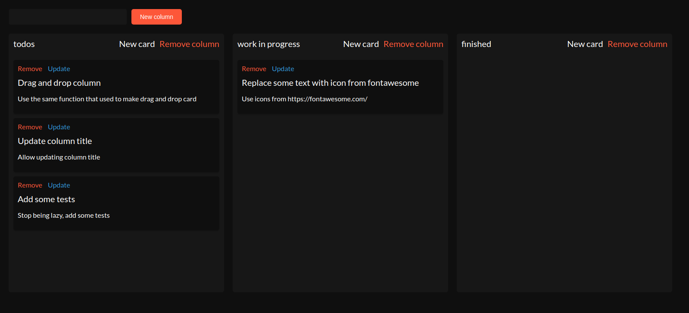

# Akanban

<p algin="center">
  
</p>

## About this project

This is a simple kanban board that I created to try out Angular. It's generated using Angular CLI. All board data is saved in `localStorage` therefore it doesn't require any fancy database connection.

## Todo

- [ ] Replace some text with icon from fontawesome
- [ ] Drag and drop column
- [ ] Update column title
- [ ] Add some tests

## Develop

1. Clone this repo
2. Install all dependencies using

```
npm i
```

3. Run the app

```
npm start
```

4. The app is served on `localhost:4200`
